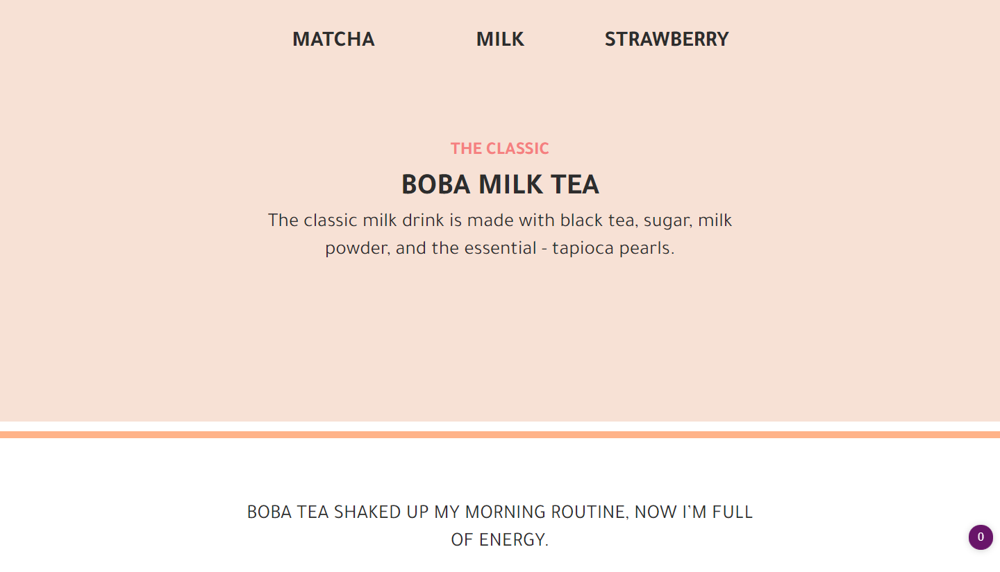

<h1>Boba Tea - Product Page</h1>
 This is a solution to the
 
[freeCodeCamp "Build a Product Landing Page."](https://www.freecodecamp.org/learn/responsive-web-design/responsive-web-design-projects/build-a-product-landing-page).

freeCodeCamp is a non-profit organization that consists of an interactive learning web platform, an online community forum, chat rooms, online publications and local organizations that intend to make learning web development accessible to anyone.

<!-- REPLACE HREFS -->

<h2>Overview</h2>

  This project was a fun one, using the lovely design of boba tea, I decided to create a colourful layout for this webpage.
  
  I originally had images displayed on here; however, because they were ripped from unsplash with edits, I felt they didn't fit this page, so I instead removed them.
  Although; looking back, I could have used a template image to showcase the location.

